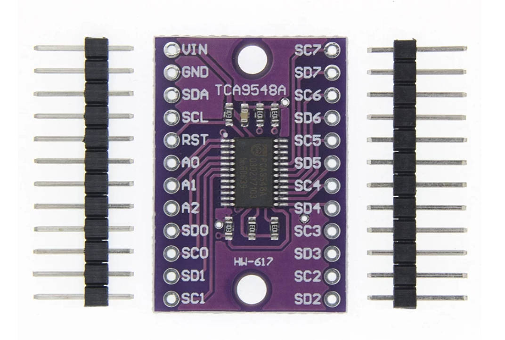

# TCA9548A Klipper Add-on

[English](README.md) | [简体中文](README_CN.md)

用于 Klipper 的 TCA9548A I2C 复用器扩展。它管理通道选择和复用器后设备的串行
访问，并提供 AHT1x、AHT2x、AHT3x、BME280 和 SHT3X 的 Klipper 温度传感器适配器。

项目最初面向 [EMU](https://github.com/DW-Tas/EMU) 部署场景：MMB/AFC 控制板的
I2C 接口不足时，TCA9548A 可让多个下游设备共用一条硬件 I2C 总线，同时按复用器
通道独立寻址。

每次受支持环境传感器的初始化或测量只会在完整操作期间选中对应通道，完成后关闭
TCA9548A 的全部通道。这样空闲或断开的下游支路会与共享的上游 I2C 总线隔离。将来的多次传输驱动
（例如 PN532）必须用一个 `mux.session(close_on_exit=True)` 包住完整的命令、
ACK 和响应交换，不能将每次传输拆成独立会话。

## 硬件与接线

<p align="center">
  
</p>

上图为常见的 HW-617 TCA9548A 转接板。将上游总线接至 MCU 或控制板：

| TCA9548A 引脚 | 连接方式 |
| --- | --- |
| `VIN` | 3.3V 或 5V 电源 |
| `GND` | 控制器地 |
| `SDA` | 控制器 I2C SDA |
| `SCL` | 控制器 I2C SCL |
| `RST` | 通过电阻上拉至 `VIN`/VCC，不能悬空。可选的开漏 MCU GPIO 可将其拉低以复位。 |
| `A0`、`A1`、`A2` | 保持未连接时使用默认 I2C 地址 `0x70`（十进制 `112`） |

将每个下游设备的 SDA/SCL 接到相应的复用器通道：通道 0 使用 `SD0`/`SC0`，通道 7
使用 `SD7`/`SC7`。下游设备的供电和地线需要分别连接。相同 I2C 地址的设备可放在
不同通道，因为同一时间只有被选中的通道会与上游总线连通。

### 可选硬件复位

在复用器段设置 `reset_pin` 后，扩展可以不经 I2C 直接复位 TCA9548A。
`reset_active_high` 表示“请求复位的 MCU GPIO 电平”。不要在 `reset_pin` 上使用
Klipper 的 `!` 反相前缀；扩展会拒绝这种写法，以确保极性只有一个明确的配置来源。
设置了 `reset_pin` 但没有设置此选项时，默认值为 `True`，匹配本板的 N-MOS 下拉复位
电路。

| 硬件连接 | `reset_active_high` | MCU 正常输出 | MCU 复位输出 |
| --- | --- | --- | --- |
| GPIO 直接连接 TCA `RESET#` | `False` | 高 | 低 |
| GPIO 接 N-MOS 栅极，N-MOS 将 `RESET#` 拉低 | `True` | 低 | 高 |

当 TCA9548A 供电为 5V 时，使用 N-MOS 下拉方案。`RESET#` 通过 10k 电阻上拉至 TCA
的 5V 电源；MOS 漏极接 `RESET#`、源极接 GND、栅极接 MCU GPIO，并用 10k 栅极下拉
电阻接 GND。这样 5V 上拉能够提供有效高电平，而 MCU 只驱动 MOS 栅极。3.3V 推挽
GPIO 直接接到 5V 的 `RESET#` 无法将其释放到 5V，不建议这样连接。

以下是本板 N-MOS 接法的默认配置。取消两行复位配置前的注释即可启用硬件复位：

```ini
[tca9548a mux1]
i2c_mcu: EMU_1
i2c_bus: i2c1_PB6_PB7
i2c_address: 112
environment_report_time: 60
# zero_temperature_on_error: False
# zero_humidity_on_error: False

# reset_pin: EMU_1:PC12
# reset_active_high: True
# 板载 N-MOS 电路：PC12 为高时将 TCA RST 拉低；PC12 为低时正常工作。
# reset_pulse_time: 0.010          # 默认：10 ms
# reset_settle_time: 0.010         # 默认：10 ms
# reset_recovery_cooldown: 30      # 默认：30 s
```

在 Klipper 启动、MCU 重启和 Klipper 关闭时，该引脚都会被设为正常的非复位电平。一次
复位脉冲会清除 TCA9548A 控制寄存器并断开所有下游 I2C 通道；它不会切断下游设备的
3.3V/5V 电源。

重启 Klipper 后，可用以下命令测试接线：

```text
TCA_RESET MUX=mux1
```

在现代 I2C 固件上，命令会在脉冲后写入 `0x00` 并读取 TCA 控制寄存器，确认所有通道
均已关闭。在旧版 I2C 固件上，它只发送硬件脉冲，不做 I2C 验证，因为失败的旧版验证
可能会使 MCU 固件停机。

当配置了 `reset_pin`，且现代 I2C 协议在访问 TCA 控制寄存器本身时报告任何错误，
扩展会自动发送复位脉冲、验证所有通道均已关闭，并只重试一次原控制操作。默认每 30 秒
最多自动尝试一次。下游传感器的 `START_NACK` 一类错误不会直接复位 TCA，而是仍按
传感器逻辑重试；若该故障之后妨碍访问 TCA 控制寄存器，产生的 TCA 错误才会触发硬件
恢复。

控制台将自动尝试显示为简短的红色错误行，例如
`TCA9548A mux1: BUS_TIMEOUT; hardware reset`；验证成功后会显示普通行
`reset verified; retrying`。复用器状态还包含复位配置、计数和最近一次复位结果。

## 安装

在 Klipper 或 Kalico 主机上运行：

```bash
cd ~
git clone https://github.com/jacksky6/TCA9548A-klipper-addon.git
cd TCA9548A-klipper-addon
./install.sh
```

安装程序会显示当前 Git 分支，以 10 秒超时检查该分支远端是否有更新，并在更新前询问。
之后它会检测 Klipper 或 Kalico，并在其 extras 目录创建以下软链接：

```text
tca9548a.py
tca9548a_drivers/
```

为兼容升级，安装程序会移除这两个准确路径上原有的软链接、普通文件或目录，然后创建
当前软链接。因此旧版单文件安装和旧版驱动目录会自动迁移。

安装程序不会重启 Klipper 或 Kalico；安装后请在 Fluidd/Mainsail 中执行“重启 Klipper”。

单独使用 `-b` 或 `--branch` 会列出本地和 `origin` 分支，然后交互选择。使用
`-b BRANCH` 或 `--branch BRANCH` 可直接切换，例如 `./install.sh -b dev`。请求的
分支不在本地时，安装程序会以同样的 10 秒超时从 `origin` 获取。使用 `-s` 或
`--skip-update` 可跳过远端更新检查并从当前本地文件安装；同时使用 `-b BRANCH` 时，
目标分支必须已存在于本地或本地 `origin` 缓存中。非交互运行时，发现更新只会提示，
安装仍使用本地文件继续执行。

### I2C 恢复特征检查

安装时，脚本会检查目标 Klipper 或 Kalico 的 `bus.py` 是否具备返回
`i2c_bus_status` 的现代 `i2c_transfer` 协议。它会显示检测到的固件类型和当前 Git
版本。该协议由 Klipper 提交 `8965958a8b6c` 于 2026-02-07 引入，`git describe` 显示
为 `v0.13.0-525-g8965958`；需要此版本或更新的、相互匹配的主机和 MCU 固件。检测结果
分为两个层级：

- **支持的主机源码：** 扩展的可恢复环境传感器驱动可在主机侧接收 I2C `NACK`、`START_NACK`、
  `START_READ_NACK` 与 `BUS_TIMEOUT` 状态，而不经过会将这些状态升级为主机停机的
  Klipper 公共 I2C 辅助接口。相关 MCU 仍必须用匹配的现代固件重新编译并刷写。
  驱动的 `i2c_status_supported` 状态字段显示配置 MCU 的最终运行时结果。
- **旧版主机源码：** 旧版 MCU 固件会在 Python 驱动处理前，对这类 I2C 失败执行自身的
  `shutdown()`。扩展仍兼容此类源码，但无法保证缺失或失效的环境传感器不会停止
  Klipper/Kalico。安装程序会解释该限制并要求确认后才继续。

有意在旧版目标上非交互安装时，使用：

```bash
./install.sh --allow-legacy-i2c
```

该参数只表示接受限制，不会让旧版主机或 MCU 固件获得恢复能力。

## 卸载

用以下任一命令移除已安装的软链接：

```bash
./install.sh --uninstall
# 或：./install.sh -u
```

仓库目录会保留。若配置了 Moonraker 更新，请手动从 `moonraker.conf` 移除
`[update_manager tca9548a]` 段，重启 Moonraker，然后在 Fluidd/Mainsail 中重启 Klipper。

## Fluidd/Mainsail 更新

Fluidd 和 Mainsail 通过 Moonraker Update Manager 显示更新状态。初始安装完成后，在
`~/printer_data/config/moonraker.conf` 中添加：

```ini
[update_manager tca9548a]
type: git_repo
path: ~/TCA9548A-klipper-addon
origin: https://github.com/jacksky6/TCA9548A-klipper-addon.git
primary_branch: main
install_script: install.sh
is_system_service: False
```

保存后重启 Moonraker。更新页将显示此仓库，并在每次更新后运行 `install.sh` 以保持
软链接正确。脚本会尝试快进 Git 更新，然后替换其两个扩展路径上的现有文件、目录或
软链接，再重新创建当前软链接。

旧版 I2C 目标上，Moonraker 会以非交互方式运行，安装将在恢复能力确认处停止。请升级
Klipper/Kalico 和 MCU 固件，或在 `moonraker.conf` 中明确接受限制：

```ini
install_script: install.sh --allow-legacy-i2c
```

此配置特意未设置 `managed_services`，所以更新不会重启 Klipper。
`is_system_service: False` 也告知 Moonraker `tca9548a` 不是可重启的系统服务。准备好
加载更新后的扩展时，请手动在 Fluidd/Mainsail 中重启 Klipper。

请在自己的 `printer.cfg` 中配置 `[tca9548a]` 和 `[temperature_sensor]` 段，使其符合
实际连接的传感器、I2C 地址和复用器通道。不要不加修改地复制示例配置。

### Happy-Hare RFID PN532 集成（计划中）

该集成尚未实现。实现后，TCA9548A 复用器核心仍作为独立 Klipper Extra 安装于
`klippy/extras/tca9548a.py`。Happy-Hare-RFID-Reader 的 PN532 复用器适配器只会位于
`nfc_gates/pn532_tca9548a_driver.py`，并引用已安装的复用器核心。

适配器应使用 `mux.session(close_on_exit=True)` 包住一次完整的 PN532 命令交换，使命令、
ACK 和响应传输期间保持同一通道被选中，完成后隔离全部下游通道。

RFID 项目及其安装程序不得打包、复制、下载或覆盖 `tca9548a.py`。用户可能已经安装了
本扩展；NFC 复用器配置应在缺少该扩展时提示用户安装，存在时则保留现有文件和版本。
通用 TCA9548A 行为仅在本仓库维护。

支持的传感器类型：

```text
AHT1X_TCA9548A
AHT2X_TCA9548A
AHT3X_TCA9548A
BME280_TCA9548A
SHT3X_TCA9548A
```

## 配置参考

以下参考涵盖多个支持的传感器类型。只保留与实际硬件相符的段落，并按硬件调整复用器
设置、通道号、I2C 地址和温度范围。

```ini
[tca9548a mux1]
i2c_mcu: EMU_1
i2c_bus: i2c1_PB6_PB7
i2c_address: 112 # 0x70，A0/A1/A2 均为低；0x71-0x77 使用 113-119
environment_report_time: 60
# 受支持环境传感器通信失败时，将相应值显示为 0，而非保留最后一次有效值。
# 只能在此复用器段设置，不能写入 [temperature_sensor] 段。
# zero_temperature_on_error: False
# zero_humidity_on_error: False
# 可选 TCA RST 控制，见“可选硬件复位”。
# reset_pin: EMU_1:PC12
# reset_active_high: True
# 板载 N-MOS 电路：PC12 为高时将 TCA RST 拉低；PC12 为低时正常工作。

[temperature_sensor Lane_0]
sensor_type: AHT2X_TCA9548A
tca9548a: mux1
tca9548a_channel: 0
i2c_address: 56
min_temp: -20
max_temp: 80

[temperature_sensor Lane_1]
sensor_type: AHT2X_TCA9548A
tca9548a: mux1
tca9548a_channel: 1
i2c_address: 56
min_temp: -20
max_temp: 80

[temperature_sensor Lane_2]
sensor_type: AHT2X_TCA9548A
tca9548a: mux1
tca9548a_channel: 2
i2c_address: 56
min_temp: -20
max_temp: 80

[temperature_sensor Lane_3]
sensor_type: AHT2X_TCA9548A
tca9548a: mux1
tca9548a_channel: 3
i2c_address: 56
min_temp: -20
max_temp: 80

[temperature_sensor Lane_4]
sensor_type: AHT2X_TCA9548A
tca9548a: mux1
tca9548a_channel: 4
i2c_address: 56
min_temp: -20
max_temp: 80

[temperature_sensor Chamber_BME]
sensor_type: BME280_TCA9548A
tca9548a: mux1
tca9548a_channel: 5
i2c_address: 118
min_temp: -20
max_temp: 80

[temperature_sensor Chamber_SHT]
sensor_type: SHT3X_TCA9548A
tca9548a: mux1
tca9548a_channel: 6
i2c_address: 68
min_temp: -20
max_temp: 80
```

`[tca9548a mux1]` 段同时定义复用器并加载插件，不需要独立的 `[tca9548a]` 段。将该段
放在使用 `*_TCA9548A` 传感器类型的所有 `[temperature_sensor]` 段之前。

在 `[tca9548a mux1]` 中填写控制板的 Klipper MCU 名称和 I2C 总线名：`i2c_mcu` 与
`i2c_bus`。该段是所有复用器后设备的 `i2c_mcu`、`i2c_bus`、`i2c_speed` 和软件 I2C
引脚设置的唯一来源；下游传感器段中同名的设置会被忽略。示例使用
`EMU_1` 与 `i2c1_PB6_PB7`。

`environment_report_time` 是该复用器下环境传感器的轮询间隔，单位秒，默认为 `60`。
TCA9548A AHT 传感器段刻意不支持 `aht10_report_time`；请在复用器段设置共享轮询间隔，
以便一起调度所有通道。`BME280_TCA9548A` 不支持单传感器 `bme280_report_time`，
`SHT3X_TCA9548A` 也使用复用器间隔，不支持单传感器 `sht3x_report_time`。

`zero_temperature_on_error` 和 `zero_humidity_on_error` 是 AHT、BME280 和 SHT3X
通信失败时的可选布尔设置，默认均为 `False`，分别保留温度或湿度的最后一次有效值。将其中
任一项设为 `True`，则仅在失败后将对应值报告为 `0`。这两个选项只能写在
`[tca9548a ...]` 复用器段，不支持在单独的 `[temperature_sensor ...]` 段设置。由失败
产生的零值不会参与 `min_temp` 或 `max_temp` 检查。

Klipper 启动时，每个复用器会记录环境传感器调度计划。同一复用器下的传感器会在
`environment_report_time` 内均匀错开，避免周期轮询集中在同一时刻。

## 环境传感器 I2C 恢复

`AHT1X_TCA9548A`、`AHT2X_TCA9548A` 和 `AHT3X_TCA9548A` 使用扩展独立的
`tca9548a_drivers/aht.py` 驱动。`BME280_TCA9548A` 和 `SHT3X_TCA9548A` 保留系统
已安装 Klipper/Kalico 的测量算法，但使用扩展提供的恢复包装与同一可恢复复用器传输层。
无需修改 Klipper/Kalico 本身。

使用现代主机和匹配 MCU 固件时，任一受支持类型的初始化或采样失败都不会停止其定时器。
驱动会记录失败、将读数标为无效，并在共享的 `environment_report_time` 后重试完整传感器
初始化。默认保留最后一次有效的温湿度值；两个复用器级 `zero_*_on_error` 选项可分别让
温度或湿度报告为零。BME280 已关闭气压采样与补偿计算，因此对外展示的温湿度字段与 AHT
一致。重试成功后读数会重新有效。相同错误在 `klippy.log` 中会被限频。Fluidd/Mainsail 控制台会显示失败阶段、I2C
状态和重试间隔，例如 `TCA9548A BME280 chamber: measurement failed: START_NACK; retry in 60s`，
并将其作为 Klipper 错误行显示，因而使用前端的错误颜色。测量失败后的后续重试若显示
`initialization failed`，表示驱动正在再次采样前重新初始化传感器。详细的 MCU、地址、
操作和异常信息仍保留在 `klippy.log`。

某个失败已显示在控制台后，下一次首次成功的重试会以普通控制台行显示，例如
`TCA9548A SHT3X chamber: recovered`。该关联状态只保存在当前 Klipper 进程中：Klipper
重启会创建新的传感器会话，不会延迟补发恢复消息。启动阶段的失败若在显示到控制台前
已恢复，同样保持静默。

每个可恢复环境传感器对象的状态均包括 `valid`、`communication_ok`、`last_error`、
`last_error_time`、`last_success_time`、`i2c_error_count`、`error_count`、
`i2c_status_supported` 和 `tca9548a_channel`。温度传感器对象可用时，这些字段也会加入
关联的 `temperature_sensor` 状态。

当前恢复机制只适用于上述 AHT、BME280、SHT3X 类型的 I2C 传输错误与损坏测量数据，
不改变 PN532 或其他下游设备的错误语义。配置传感器的 `min_temp` 或 `max_temp` 违反
仍属于普通 Klipper 安全停机。I2C 错误本身不会切换 TCA9548A `RST` 引脚、对下游设备
发送复位或切断下游电源。配置了可选的 `reset_pin` 后，之后发生的 TCA 控制寄存器访问
错误才可能触发前述复用器硬件恢复。

若 TCA9548A 的 A0/A1/A2 上拉或下拉方式不同，请调整 `i2c_address`。默认 `112`
即 `0x70`；Klipper 要求十进制 I2C 地址。AHT20 的 `0x38` 地址应写为 `56`，SHT3X 默认
`0x44` 地址应写为 `68`。

## 调试

仅测试复用器时，可启用：

```ini
[tca9548a mux1]
debug_no_disable: True
# select_delay: 0.01
# verify_select: True

[temperature_sensor Lane_0]
debug_skip_init: True
```

这样启动时不会自动向复用器写入数据，也不会初始化 AHT2X 传感器。Klipper 到达 ready
状态后，可手动执行：

```gcode
TCA_SELECT MUX=mux1 CHANNEL=0
TCA_STATUS MUX=mux1
TCA_SELECT MUX=mux1
```

第一条命令选择通道 0；`TCA_STATUS` 读取 TCA9548A 控制寄存器；最后一条命令关闭所有
通道。

`select_delay` 在每次复用器写入后等待，默认 `0`，因为 TCA9548A 通常不需要命令处理
延迟。`verify_select` 会在每次写入后读回控制寄存器，只有读回字节与请求通道掩码一致时
才报告成功。

`debug_no_disable` 默认 `False`。它为 `False` 时，插件会在 Klipper 启动期间向
TCA9548A 写入 `0x00`，在正常传感器初始化前关闭全部复用器通道。设为 `True` 会跳过
启动时的关闭写入，只适合调试复用器硬件状态。

`debug_skip_init` 默认 `False`。对于 AHT 复用器传感器，设为 `True` 会跳过传感器初始
化，使 Klipper 可以先进入 ready 状态后再手动测试复用器。正常配置应保持两个调试选项
未设置。

## 说明

此原型刻意只支持有限的环境传感器。AHT 系列是 `tca9548a_drivers/aht.py` 中的独立驱动；
BME280 和 SHT3X 当前包装系统已安装的 Klipper/Kalico 驱动。所有适配器都会在每次 I2C
写入/读取前重新选择 TCA9548A 通道，避免在 reactor 暂停期间依赖之前的复用器状态。

## 许可证

本项目使用 GNU General Public License v3.0 或更高版本，详见 [LICENSE](LICENSE)。
